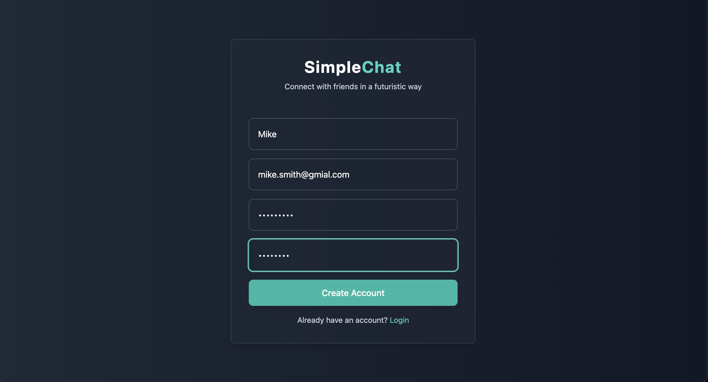
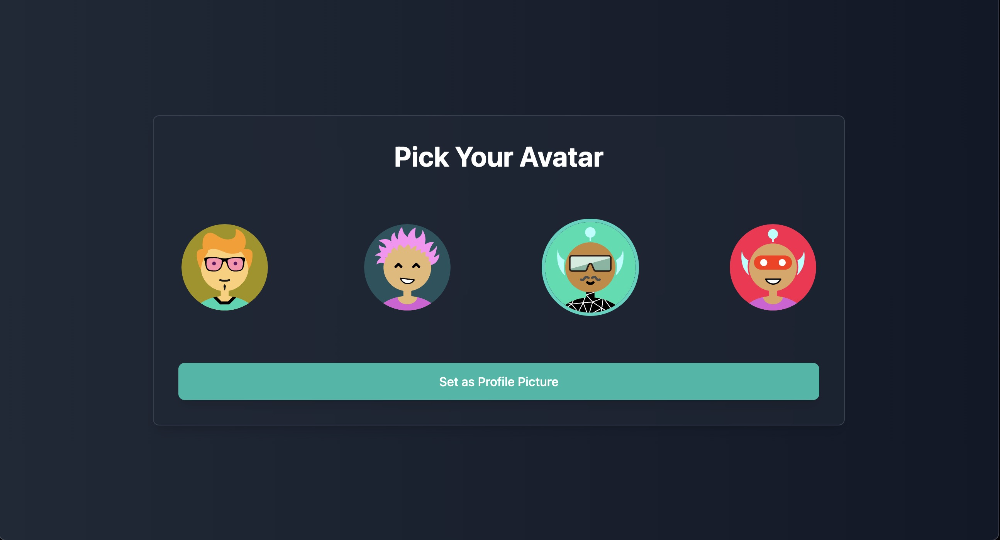
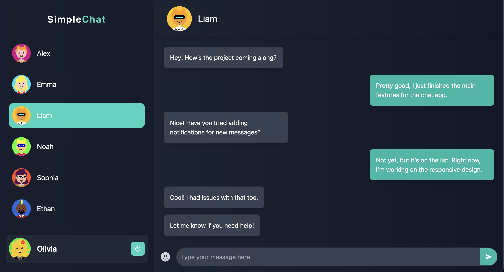
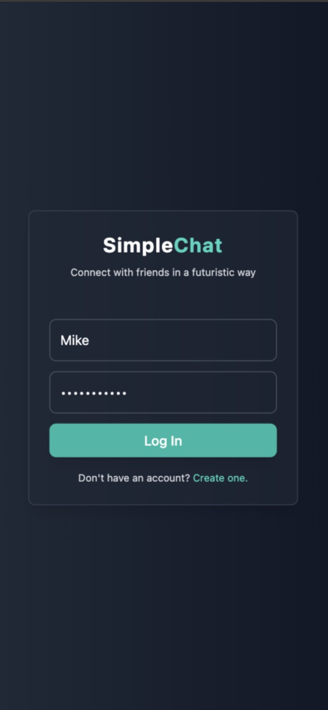
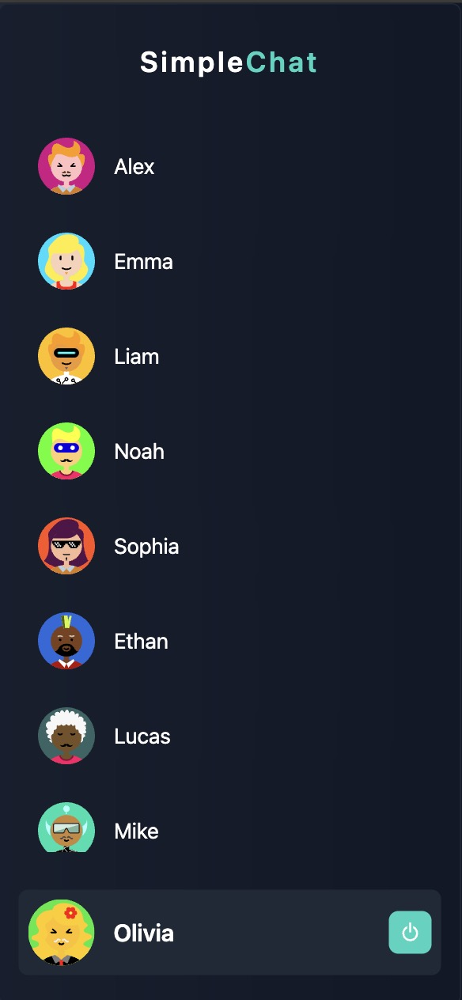
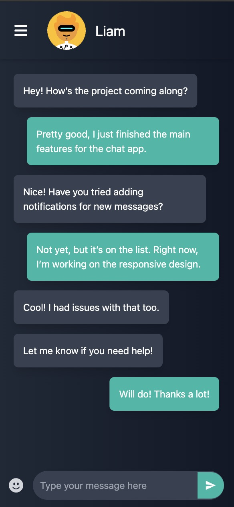
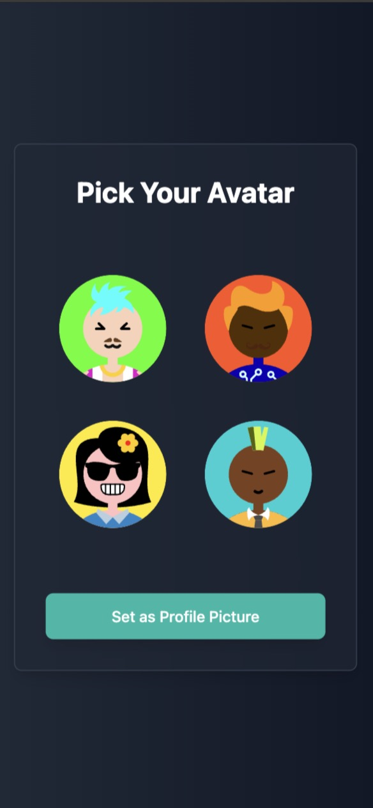

# Simple Chat App

A real-time chat application built with **React** and **Node.js**, using **Socket.IO** for messaging, and **MongoDB** for storing user data and chats.

## Features

- **User Authentication:** Secure registration and login.
- **Real-time Messaging:** Instant message exchange between users using Socket.IO.
- **Responsive Design:** Works seamlessly on phones, tablets, and desktops.
- **User Avatars:** Users can select avatars during registration.
- **Mobile-Friendly:** Optimized for mobile devices with responsive contacts sidebar.
- **Dark Futuristic Theme:** UI design focused on modern, sleek aesthetics.
- **Media Sharing:** Share images, files, and more (optional).

## Screenshots

Here are a few screenshots of the app in action:

### For desktop:

- **Registration Page**: 
- **Avatar Selection**: 
- **Chat Interface**: 

### For mobile:

<table>
  <tr>
    <td></td>
    <td></td>
  </tr>
  <tr>
    <td></td>
    <td></td>
  </tr>
</table>

## Tech Stack

- **Frontend:** React, TailwindCSS
- **Backend:** Node.js, Express
- **Database:** MongoDB (with Mongoose for database interactions)
- **Real-time Messaging:** Socket.IO

## Setup Instructions

1. Clone this repository:
   ```bash
   git clone https://github.com/kerBiy/simple-chat.git
   ```
2. Navigate to the project directory:

   ```bash
   cd simple-chat
   ```

3. Install the dependencies for both the server and client:

   - Server:

     ```bash
     cd server
     yarn
     ```

   - Client:
     ```bash
     cd client
     yarn
     ```

4. Create a `.env` file in the `server` directory and add the following:

   ```bash
   PORT=5000
   MONGO_URI=your_mongodb_connection_string
   ```

5. Start the development servers:

   - Server:

     ```bash
     cd server
     nodemon index.js
     ```

   - Client:
     ```bash
     cd client
     yarn dev
     ```

6. Open the app in your browser at `http://localhost:5173`.

7. Enjoy.
